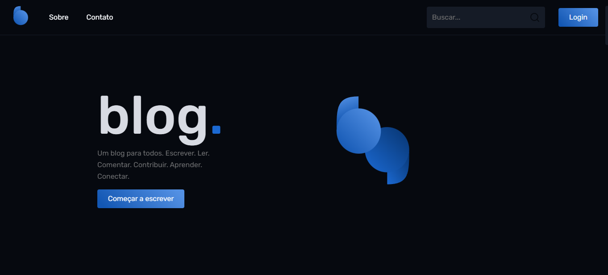
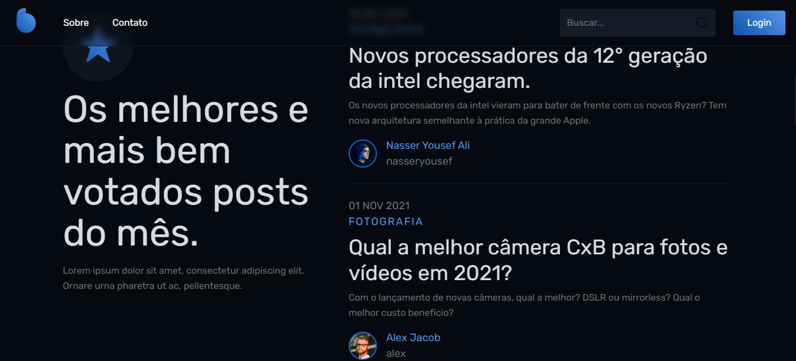
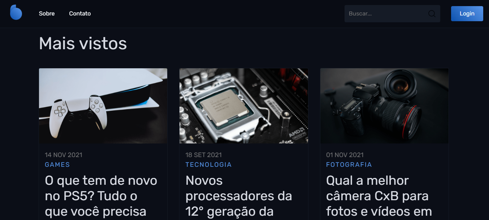
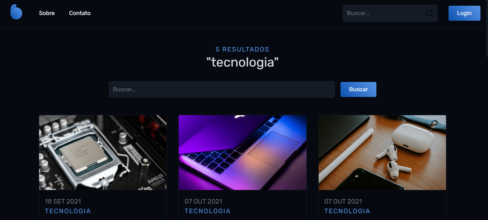
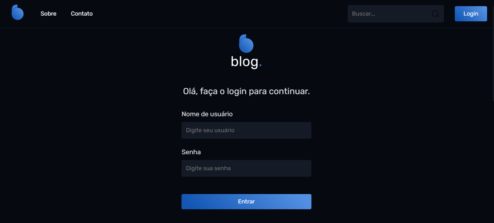

    

# React Blog

This project I developed on Front PUSH course, a course focused on front-end development. This project is the finish project focusing in UI Design and an SPA (Single Page Application) using React.js.

## 🚀 Technologies

### This project was developed with the followings technologies:

<ul>
  <li>React.js</li>
  <li>HTML</li>
  <li>CSS</li>
  <li>JavaScript</li>
</ul>

### Other technologies:

<ul>
  <li>SASS</li>
  <li>React Router Dom</li>
</ul>

### Developed abilities:
- [X] SPA (Single Page Application)
- [X] UI Design
- [X] Responsivity
- [X] Pixel Perfect
- [X] Figma

<!-- ## 💻 Project

You can view the project through this link <a href="https://klaytonjr.github.io/Nubank-Redesign/">Click here</a>. -->

# Run Project

`npm install`
To install the dependecies.

`npm start`
To run the project

To run the mock backend

`npm install -g json-server`

and run the fake back-end on port 4000

`json-server --watch db.json --port 4000` 

## Screenshots

